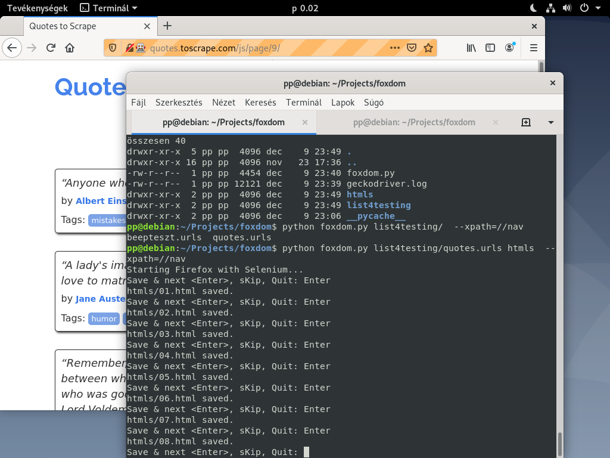

# foxdom

Helper script for manual crawl web pages and saving them to particular directory. For now, it only works under Linux due to the os.system() function.

Firstly you need to set the (pseudo) "constants": 
+ CONST_PROFILE = path to Firefox profile (optional)
+ CONST_DRIVER = path to Selenium FF driver (if Selenium not found)

Additional settings in the script are: CONST_DELIMITER (for os path), CONTROL_XPATH



This script has its own help:

```
python foxdom.py --help
usage: foxdom.py [-h] [--resume] [--xpath XPATH] list dir

Saves the full DOM of all URLs listed in the input file to the specified
output directory as HTML files.

positional arguments:
  list                  List file name that contains url-s. – For input.
  dir                   Output directory where the htlm-s will saved with full
                        DOM.

optional arguments:
  -h, --help            show this help message and exit
  --resume, -r          Resume an aborted processing.
  --xpath XPATH, -x XPATH
                        Control XPATH. If it does not exist in the HTML tree, 
                        it beeps.

Finished HTML files will be named with a serial number. For example: 01.html,
02.html, 03.html, ... 09.htm, 10.html. Or: 0001.html, 0002.html, ...
1234.html. The serial number is the same as the position in the list file.
```

Selenium with FireFox.
